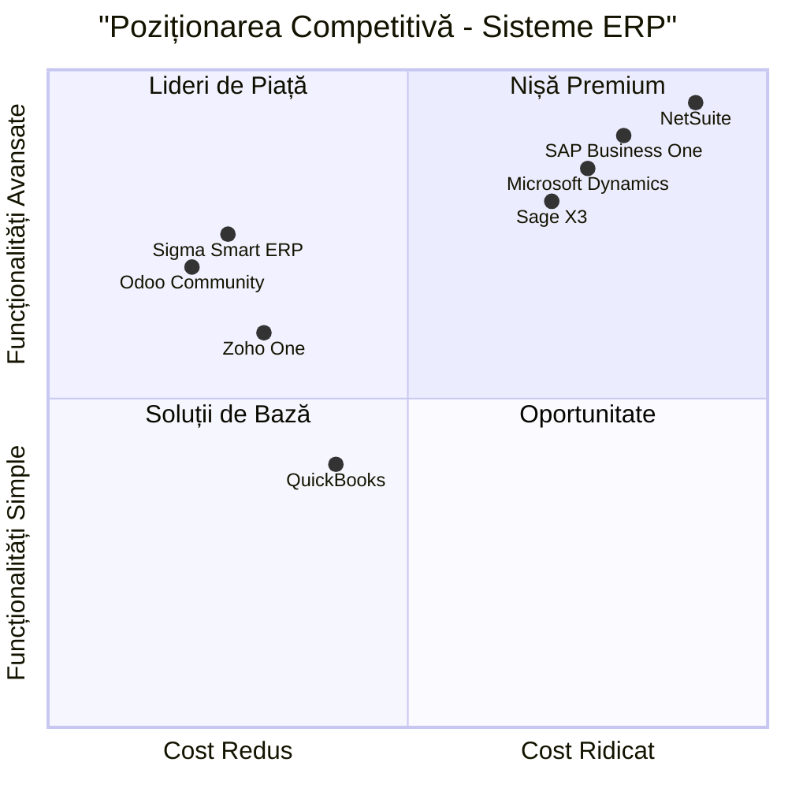

# PRD - Sigma Smart ERP
## Product Requirements Document

### Versiune: 1.0
### Data: 07 Iulie 2025
### Limbă: Română
### Tehnologii: React/Next.js, TypeScript, Tailwind CSS, Google Apps Script
### Nume Proiect: sigma_smart_erp

---

## 1. Informații Generale și Definirea Produsului

### 1.1 Reformularea Cerințelor Originale

Crearea unui sistem ERP complet funcțional denumit **Sigma Smart ERP** care să includă:
- Frontend React SPA/Next.js cu autentificare Google OAuth
- Backend Google Apps Script WebApp API
- Integrare cu 12 Google Sheets pentru stocarea datelor
- Hosting pe Vercel cu suport pentru routing SPA
- 12 module funcționale complete: facturi, TVA, depozit, comenzi, lucrări, manoperă, contracte, pontaj, clienți, furnizori, centre cost, angajați

### 1.2 Obiectivele Produsului

1. **Centralizarea Proceselor de Business**: Unificarea tuturor operațiunilor companiei într-o singură platformă integrată
2. **Automatizarea Fluxurilor de Lucru**: Reducerea muncii manuale și creșterea eficienței operaționale cu 40%
3. **Vizibilitate în Timp Real**: Monitorizarea KPI-urilor și proceselor în timp real prin dashboard-uri interactive

### 1.3 User Stories

#### Pentru Utilizatori Standard:
1. **Ca angajat**, vreau să îmi înregistrez pontajul zilnic pentru a avea evidența orelor lucrate
2. **Ca manager de proiect**, vreau să urmăresc progresul lucrărilor și costurile asociate pentru a controla bugetul
3. **Ca operator depozit**, vreau să înregistrez intrările și ieșirile de marfă pentru a menține stocul actualizat
4. **Ca contabil**, vreau să generez facturile și să urmăresc TVA-ul pentru a respecta obligațiile legale
5. **Ca responsabil HR**, vreau să gestionez contractele și concediile pentru a optimiza resursa umană

#### Pentru Administratori:
1. **Ca administrator sistem**, vreau să configurez permisiunile utilizatorilor pentru a asigura securitatea datelor
2. **Ca director executiv**, vreau să vizualizez rapoarte consolidate din toate modulele pentru a lua decizii strategice
3. **Ca manager financiar**, vreau să urmăresc cash flow-ul și rentabilitatea pe centre de cost pentru analiza performanței

### 1.4 Analiza Competitivă

#### Concurenți Principali:

1. **SAP Business One**
   - Avantaje: Funcționalități avansate, scalabilitate
   - Dezavantaje: Cost ridicat, complexitate mare

2. **Microsoft Dynamics 365**
   - Avantaje: Integrare Office 365, cloud native
   - Dezavantaje: Licensing complex, costuri recurente

3. **Odoo Community**
   - Avantaje: Open source, modular
   - Dezavantaje: Suport limitat, personalizare complexă

4. **Zoho One**
   - Avantaje: Suite completă, preț accesibil
   - Dezavantaje: Limitări customizare, performanță variabilă

5. **NetSuite**
   - Avantaje: Cloud nativ, funcționalități complete
   - Dezavantaje: Cost foarte ridicat, implementare complexă

6. **QuickBooks Enterprise**
   - Avantaje: Ușor de folosit, suport contabilitate
   - Dezavantaje: Funcționalități limitate, scalabilitate redusă

7. **Sage X3**
   - Avantaje: Funcționalități manufacturiere, raportare
   - Dezavantaje: Interface învechit, costuri întreținere

#### Grafic de Poziționare Competitivă:



---

## 2. Arhitectura Tehnică

### 2.1 Analiza Cerințelor Tehnice

**Arhitectura Generală:**
- **Frontend**: React SPA sau Next.js cu TypeScript și Tailwind CSS
- **Backend**: Google Apps Script WebApp API
- **Autentificare**: Google OAuth 2.0
- **Storage**: Google Sheets ca bază de date
- **Hosting**: Vercel pentru frontend
- **Grafice**: Recharts pentru vizualizări

### 2.2 Pool-ul de Cerințe

#### Cerințe P0 (Critice - Must Have):
- **AUTH-001**: Implementarea autentificării Google OAuth
- **MOD-001**: Dezvoltarea celor 12 module core
- **API-001**: Crearea API-urilor Google Apps Script
- **UI-001**: Interface responsive cu Tailwind CSS
- **DATA-001**: Integrarea cu Google Sheets specificat

#### Cerințe P1 (Importante - Should Have):
- **DASH-001**: Dashboard cu KPI-uri în timp real
- **CHART-001**: Grafice interactive cu Recharts
- **PERM-001**: Sistem de permisiuni utilizatori/admin
- **SEARCH-001**: Funcționalități de căutare avansată
- **EXPORT-001**: Export date în Excel/PDF

#### Cerințe P2 (Opționale - Nice to Have):
- **NOTIF-001**: Sistem de notificări
- **THEME-001**: Suport dark/light mode
- **MOBILE-001**: Optimizare pentru dispozitive mobile
- **AUDIT-001**: Log-uri de audit și istoric modificări
- **BACKUP-001**: Backup automat pentru Google Sheets

### 2.3 Specificații Tehnice Detaliate

#### 2.3.1 Frontend Architecture

**Tehnologii:**
```json
{
  "framework": "Next.js 14+",
  "language": "TypeScript",
  "styling": "Tailwind CSS",
  "charts": "Recharts",
  "authentication": "Google OAuth",
  "state_management": "React Context + useReducer",
  "routing": "Next.js App Router",
  "deployment": "Vercel"
}
```

**Structura Aplicației:**
```
src/
├── app/
│   ├── (auth)/
│   │   └── login/
│   ├── dashboard/
│   ├── facturi/
│   ├── tva/
│   ├── depozit/
│   ├── comenzi/
│   ├── lucrari/
│   ├── manopera/
│   ├── contracte/
│   ├── pontaj/
│   ├── clienti/
│   ├── furnizori/
│   ├── centre-cost/
│   └── angajati/
├── components/
│   ├── ui/
│   ├── charts/
│   ├── forms/
│   └── layout/
├── lib/
│   ├── auth/
│   ├── api/
│   └── utils/
└── types/
```

#### 2.3.2 Backend Architecture (Google Apps Script)

**Structura API:**
```javascript
// Endpoint-uri principale
const API_ENDPOINTS = {
  facturi: '/api/facturi',
  tva: '/api/tva', 
  depozit: '/api/depozit',
  comenzi: '/api/comenzi',
  lucrari: '/api/lucrari',
  manopera: '/api/manopera',
  contracte: '/api/contracte',
  pontaj: '/api/pontaj',
  clienti: '/api/clienti',
  furnizori: '/api/furnizori',
  centre_cost: '/api/centre_cost',
  angajati: '/api/angajati'
};
```

#### 2.3.3 Integrare Google Sheets

**ID-uri Google Sheets:**
```json
{
  "facturi_raw": "1tuXSfn1oBygYGBE6K-_xxRey4fT6tjCuU6qsoYrrv1A",
  "tva_raw": "1milALf9FugbSc7q5f1ljoET8eNSlL0I8AUPagSt4Zyg",
  "depozit_intrari_iesiri": "1V4S9O2rl1hGedFVREYkSwR7Q2lOMg7EJrwjxNis0eSQ",
  "comenzi_raw": "1DWaDV6ep8ZvjslK19ItQNYv0zUxpr2xzAV-6npkgBJI",
  "lucrari_master": "18wwm4PURy3iMCksv7zVzcX5Kw2z97jUpU_KMIiiSe9M",
  "manopera_raw": "1yMuIj8M66ZaW0mDy21IlJX8tb9x9v8coBIbWIRZFLU8",
  "contracte_raw": "1dhEAVUC3NJar4pNpdFoVt_BR3lhYnmilULa8U2XWXw4",
  "pontaj_log": "1VUM97oen8jOF7BZuL-Nl-1M-98SmBSzPv8EIj_nYkCY",
  "clienti_raw": "1x0_BxwtMVw1iGxXUzu5sdgqqriXkA1VPe105Rh0egJw",
  "furnizori_raw": "1iyb-O8E8U8cMiEfNarkCdPvOt7BHRyQpVIEZCYYkeBE",
  "centre_cost_master": "1qlG5b9HDgFIwWx0RR7moixXEuqse-ryzobjdgMggtvE",
  "angajati_raw": "1dhEAVUC3NJar4pNpdFoVt_BR3lhYnmilULa8U2XWXw4"
}
```

---

## 3. Specificații Funcționale Detaliate

### 3.1 Modul Facturi

**Funcționalități:**
- Creare facturi noi cu auto-completare
- Vizualizare listă facturi cu filtrare și sortare
- Export facturi în PDF
- Urmărire status plăți
- Integrare automată cu modulul TVA

**Câmpuri Principale:**
- ID_factura, Serie_factura, Numar_factura
- ID_client, Data_emitere, Data_scadenta
- Valoare_neta, TVA, Total
- Status_plata, Observatii

**KPI-uri:**
- Total facturi emise (luna curentă)
- Valoare facturi neîncasate
- Timpul mediu de încasare

### 3.2 Modul TVA

**Funcționalități:**
- Calculare automată TVA pe facturi
- Raportare TVA mensual/trimestrial
- Export declarații TVA
- Reconciliere cu facturile emise

**Câmpuri Principale:**
- ID_TVA, Perioada, Tip_operatiune
- Valoare_baza, Cota_TVA, Valoare_TVA
- ID_factura_asociata

**KPI-uri:**
- TVA de plată (perioada curentă)
- TVA deductibilă
- Diferența TVA

### 3.3 Modul Depozit

**Funcționalități:**
- Înregistrare intrări/ieșiri marfă
- Urmărire stocuri în timp real
- Alertă stocuri minime
- Rapoarte mișcare stoc

**Câmpuri Principale:**
- ID_miscare, Data_miscare, Tip_miscare
- Cod_produs, Denumire_produs
- Cantitate, UM, Preț_unitar
- Gestiune, Observatii

**KPI-uri:**
- Valoarea totală stoc
- Numărul produse cu stoc minim
- Rotația stocurilor

### 3.4 Modul Comenzi

**Funcționalități:**
- Creare comenzi noi
- Urmărire status comenzi
- Planificare livrări
- Integrare cu depozitul

**Câmpuri Principale:**
- ID_comanda, Data_comanda, Tip_comanda
- ID_client, Centru_cost, Cod_lucrare
- Status_comanda, Data_livrare
- Total_RON_calculat, Total_RON_fix

**KPI-uri:**
- Comenzi active
- Valoarea comenzilor în lucru
- Timpul mediu procesare

### 3.5 Modul Lucrări

**Funcționalități:**
- Definirea lucrărilor/proiectelor
- Urmărire progres lucrări
- Alocarea resurselor
- Calcularea costurilor

**Câmpuri Principale:**
- Cod_lucrare, Denumire_lucrare
- Data_inceput, Data_sfarsit_planificata
- Status, Procent_finalizare
- Buget_alocat, Cost_realizat

**KPI-uri:**
- Lucrări active
- Progres mediu lucrări
- Abaterea de la buget

### 3.6 Modul Manoperă

**Funcționalități:**
- Înregistrarea orelor lucrate pe proiecte
- Calcularea costurilor cu manopera
- Raportare productivitate
- Integrare cu pontajul

**Câmpuri Principale:**
- ID_manopera, Data, ID_angajat
- Cod_lucrare, Ore_lucrate
- Tarif_orar, Cost_total
- Descriere_activitate

**KPI-uri:**
- Ore totale lucrate
- Costul mediu pe oră
- Productivitatea pe angajat

### 3.7 Modul Contracte

**Funcționalități:**
- Gestionarea contractelor de muncă
- Urmărirea perioadelor contractuale
- Alertă expirare contracte
- Istoricul modificărilor

**Câmpuri Principale:**
- ID_contract, ID_angajat, Tip_contract
- Data_inceput, Data_sfarsit
- Salariu_brut, Norma_lucru
- Status_contract

**KPI-uri:**
- Contracte active
- Contracte ce expiră în 30 zile
- Costul total salarii

### 3.8 Modul Pontaj

**Funcționalități:**
- Înregistrarea intrări/ieșiri
- Calcularea orelor lucrate
- Gestionarea concediilor
- Raportare prezență

**Câmpuri Principale:**
- ID_pontaj, ID_angajat, Data
- Ora_intrare, Ora_iesire
- Ore_lucrate_normal, Ore_suplimentare
- Tip_zi (normal/concediu/CM)

**KPI-uri:**
- Prezența zilnică
- Orele suplimentare
- Concediile solicitate

### 3.9 Modul Clienți

**Funcționalități:**
- Gestionarea bazei de clienți
- Istoricul tranzacțiilor
- Segmentarea clienților
- CRM de bază

**Câmpuri Principale:**
- ID_client, Nume_client, CUI
- Adresa, IBAN, Banca
- Persoana_contact, Email, Telefon
- Status_client

**KPI-uri:**
- Numărul total clienți
- Clienți activi (ultima lună)
- Valoarea medie pe client

### 3.10 Modul Furnizori

**Funcționalități:**
- Gestionarea furnizorilor
- Urmărirea plăților către furnizori
- Evaluarea performanței
- Gestionarea contractelor

**Câmpuri Principale:**
- ID_furnizor, Nume_furnizor, CUI
- Adresa, IBAN, Banca
- Persoana_contact, Email, Telefon
- Categorie_furnizor

**KPI-uri:**
- Numărul total furnizori
- Plățile restante
- Valoarea achiziților lunare

### 3.11 Modul Centre de Cost

**Funcționalități:**
- Definirea centrelor de cost
- Alocarea cheltuielilor
- Raportarea pe centre de cost
- Analiza rentabilității

**Câmpuri Principale:**
- ID_centru_cost, Descriere
- Activ, Observatii
- Responsabil, Buget_alocat

**KPI-uri:**
- Centre de cost active
- Execuția bugetară
- Costul pe centru

### 3.12 Modul Angajați

**Funcționalități:**
- Evidența angajaților
- Gestionarea datelor personale
- Històricul profesional
- Documente HR

**Câmpuri Principale:**
- ID_angajat, Nume, Prenume
- CNP, Data_nasterii
- Functia, Departament
- Data_angajare, Status

**KPI-uri:**
- Numărul total angajați
- Angajări noi (luna curentă)
- Fluctuația personalului

---

## 4. Specificații UI/UX

### 4.1 Design System

**Paleta de Culori:**
- Primary: #1E40AF (Blue 800)
- Secondary: #059669 (Green 600)  
- Accent: #DC2626 (Red 600)
- Neutral: #6B7280 (Gray 500)
- Background: #F9FAFB (Gray 50)

**Tipografie:**
- Font Principal: Inter
- Heading: font-bold, text-2xl/3xl
- Body: font-medium, text-base
- Caption: font-normal, text-sm

**Layout:**
- Sidebar fixat (250px width)
- Header fix (64px height)
- Content area responsive
- Cards cu shadow-sm și rounded-lg

### 4.2 Componente UI

**Layout Principal:**
- **Sidebar**: Navigare între module cu iconițe
- **Header**: Logo, search bar, user profile, dark mode toggle
- **Main Content**: Dashboard sau modul selectat
- **Footer**: Copyright și versiune

**Componente de Bază:**
- **KPI Cards**: Metrici importante cu trend indicators
- **Data Tables**: Sortare, filtrare, paginare
- **Charts**: Bar, pie, line charts cu Recharts
- **Forms**: Input validation, error handling
- **Modals**: Pentru crearea/editarea înregistrărilor

### 4.3 Responsive Design

**Breakpoints:**
- Mobile: 320px - 768px
- Tablet: 768px - 1024px  
- Desktop: 1024px+

**Adaptări Mobile:**
- Sidebar colapsabil
- Cards stacked vertical
- Tables cu scroll horizontal
- Touch-friendly buttons (min 44px)

---

## 5. Autentificare și Securitate

### 5.1 Google OAuth Integration

**Flow de Autentificare:**
1. User accesează aplicația
2. Redirect către Google OAuth
3. User se autentifică cu contul Google
4. Primire token de acces
5. Validarea token-ului pe backend
6. Setarea session-ului utilizator

**Configurare OAuth:**
```javascript
const googleAuthConfig = {
  clientId: process.env.GOOGLE_CLIENT_ID,
  redirectUri: `${process.env.NEXT_PUBLIC_APP_URL}/auth/callback`,
  scopes: [
    'openid',
    'profile', 
    'email',
    'https://www.googleapis.com/auth/spreadsheets'
  ]
};
```

### 5.2 Sistem de Permisiuni

**Roluri Utilizatori:**
- **User**: Acces la datele proprii și modulele asignate
- **Manager**: Acces la datele echipei și rapoarte
- **Admin**: Acces complet și configurare sistem

**Matrice Permisiuni:**
```json
{
  "user": {
    "facturi": ["read"],
    "pontaj": ["read", "write"],
    "profile": ["read", "write"]
  },
  "manager": {
    "facturi": ["read", "write"],
    "pontaj": ["read"],
    "rapoarte": ["read"]
  },
  "admin": {
    "*": ["read", "write", "delete"]
  }
}
```

### 5.3 Securitatea Datelor

**Măsuri de Securitate:**
- HTTPS obligatoriu pentru toate conexiunile
- Validarea token-urilor Google OAuth pe fiecare request
- Sanitizarea input-urilor pentru prevenirea XSS
- Rate limiting pentru API-uri
- Audit logs pentru operațiuni critice

---

## 6. Draft Design UI

### 6.1 Dashboard Principal

```
┌─────────────────────────────────────────────────────────────┐
│ [Logo] Sigma Smart ERP    [Search]     [🌙] [User Avatar ▼] │
├─────────────────────────────────────────────────────────────┤
│ │ 📊 Dashboard     │                                       │
│ │ 🧾 Facturi       │  KPI Cards Row:                       │
│ │ 📈 TVA           │  ┌───────┐ ┌───────┐ ┌───────┐       │
│ │ 📦 Depozit       │  │Total  │ │Facturi│ │Angajați       │
│ │ 📋 Comenzi       │  │Vânzări│ │Restante│Activi │       │
│ │ 🏗️ Lucrări       │  │450K lei│ │25    │ │67     │       │
│ │ 👷 Manoperă      │  └───────┘ └───────┘ └───────┘       │
│ │ 📄 Contracte     │                                       │
│ │ ⏰ Pontaj        │  Charts Section:                      │
│ │ 👥 Clienți       │  ┌─────────────────┐ ┌───────────────┐│
│ │ 🏭 Furnizori     │  │   Vânzări       │ │ Top Clienți   ││
│ │ 💰 Centre Cost   │  │   Lunare        │ │               ││
│ │ 👤 Angajați      │  │  [Bar Chart]    │ │ [Pie Chart]   ││
│ │                  │  └─────────────────┘ └───────────────┘│
└─────────────────────────────────────────────────────────────┘
```

### 6.2 Layout Modul (Exemplu: Facturi)

```
┌─────────────────────────────────────────────────────────────┐
│                    Facturi                                  │
├─────────────────────────────────────────────────────────────┤
│ [➕ Factură Nouă] [📤 Export] [🔍 Căutare: _________]      │
│                                                             │
│ Statistici Rapide:                                          │
│ ┌──────────┐ ┌──────────┐ ┌──────────┐ ┌──────────┐       │
│ │ Total    │ │ În       │ │ Restante │ │ Plătite  │       │
│ │ Facturi  │ │ Progres  │ │          │ │          │       │
│ │   156    │ │    23    │ │    12    │ │   121    │       │
│ └──────────┘ └──────────┘ └──────────┘ └──────────┘       │
│                                                             │
│ Tabel Facturi:                                              │
│ ┌───┬─────────┬──────────┬────────┬─────────┬─────────────┐ │
│ │ # │ Serie   │ Client   │ Data   │ Valoare │ Status      │ │
│ ├───┼─────────┼──────────┼────────┼─────────┼─────────────┤ │
│ │ 1 │ FAC-001 │ ABC SRL  │ 05.07  │ 2,500   │ 🟢 Plătită │ │
│ │ 2 │ FAC-002 │ XYZ SRL  │ 03.07  │ 1,800   │ 🟡 În Prog │ │
│ │ 3 │ FAC-003 │ DEF SRL  │ 01.07  │ 3,200   │ 🔴 Restantă│ │
│ └───┴─────────┴──────────┴────────┴─────────┴─────────────┘ │
│                            [1] 2 3 4 5 ... 12 >            │
└─────────────────────────────────────────────────────────────┘
```

---

## 7. Întrebări Deschise

### 7.1 Aspecte Tehnice
1. **Performanță**: Cum gestionăm volumele mari de date în Google Sheets (>10,000 rânduri)?
2. **Sincronizare**: Ce strategie folosim pentru sincronizarea datelor în timp real?
3. **Backup**: Implementăm backup automat pentru Google Sheets?
4. **Offline**: Avem nevoie de funcționalitate offline?
5. **Mobile App**: Considerăm o aplicație mobilă nativă în viitor?

### 7.2 Aspecte Business
1. **Licensing**: Cum gestionăm licensing-ul pentru utilizatori multipli?
2. **Multi-tenant**: Suportăm multiple companii pe aceeași instanță?
3. **Customizare**: Permitem customizarea câmpurilor de către utilizatori?
4. **Integrări**: Ce alte sisteme externe trebuie să integrăm?
5. **Raportare**: Ce tipuri de rapoarte avansate sunt necesare?

### 7.3 Aspecte Operaționale
1. **Training**: Ce materiale de training sunt necesare pentru utilizatori?
2. **Support**: Cum organizăm support-ul tehnic?
3. **Updates**: Cum gestionăm update-urile sistemului?
4. **Monitoring**: Implementăm monitoring și alerting?
5. **Audit**: Ce informații trebuie să auditeze sistemul?

---

## 8. Concluzie

Acest PRD definește un sistem ERP complet și modern, optimizat pentru companii mici și mijlocii care caută o soluție eficientă și cost-efectivă. Prin utilizarea tehnologiilor cloud moderne și integrarea cu ecosistemul Google, Sigma Smart ERP oferă o alternativă viabilă la soluțiile ERP tradiționale, costisitoare și complexe.

**Beneficiile cheie:**
- **Cost redus**: Folosirea Google Sheets elimină costurile cu baza de date
- **Setup rapid**: Implementare în mai puțin de 4 săptămâni  
- **Scalabilitate**: Arhitectura permite extinderea facilă
- **Integrare facilă**: Sincronizare perfectă cu ecosistemul Google
- **User Experience**: Interface modernă și intuitivă

**Următorii pași:**
1. Validarea cerințelor cu stakeholder-ii
2. Finalizarea designului UI/UX
3. Dezvoltarea MVP-ului
4. Testing și implementarea pilot
5. Training și lansarea în producție